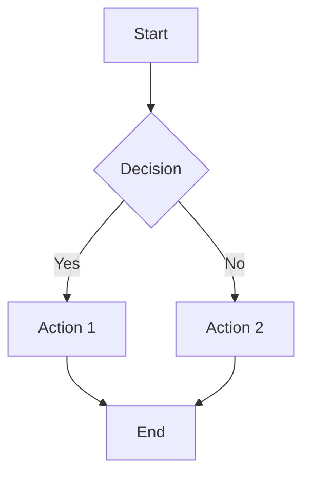

# Paul's Corner

## Overview

Welcome to Paul's Corner - a dedicated space for additional documentation, insights, and guides related to the bot controller system. This section serves as an extension point for specialized documentation that doesn't fit into the main architectural guides.

## Template for New Documentation

When adding new documentation to Paul's Corner, use this template structure:

### Document Template

```markdown
# [Document Title]

## Overview

Brief description of what this document covers and who it's intended for.

## Prerequisites

- List any required knowledge or setup
- Dependencies or tools needed
- Recommended reading order

## Main Content

### Section 1: [Topic Name]

#### Subsection

Detailed explanation with:
- Clear explanations
- Code examples where applicable
- Best practices
- Common pitfalls to avoid

```python
# Code example with comments
def example_function():
    """
    Clear docstring explaining what the function does
    """
    pass
```

#### Implementation Notes

- Important considerations
- Performance implications
- Security concerns (if applicable)

### Section 2: [Another Topic]

Continue with additional sections as needed.

## Configuration Examples

```json
{
    "example_config": {
        "setting1": "value1",
        "setting2": true,
        "nested_config": {
            "option": "example"
        }
    }
}
```

## Troubleshooting

### Common Issues

#### Issue 1: [Problem Description]
**Symptoms**: What you might see
**Cause**: Why it happens
**Solution**: How to fix it

```bash
# Command line examples
command --example --flag
```

#### Issue 2: [Another Problem]
Similar format for additional issues.

## Best Practices

1. **Practice 1**: Description and rationale
2. **Practice 2**: Another important guideline
3. **Practice 3**: Additional recommendation

## Related Documentation

- [Architecture Overview](bot-controller-architecture.md)
- [Development Guide](bot-controller-development-guide.md)
- [Other relevant docs]

## Notes

- Implementation-specific notes
- Future considerations
- Known limitations

---

**Last Updated**: [Date]  
**Author**: [Name]  
**Review Status**: [Draft/Review/Final]
```

## Available Documents

Currently, Paul's Corner is ready for new documentation. Future additions might include:

- **Advanced Configuration Patterns**
- **Performance Optimization Deep Dives**
- **Custom Integration Examples**
- **Debugging Workflows**
- **Testing Strategies**
- **Production Deployment Guides**

## Contributing Guidelines

When adding new documentation to Paul's Corner:

1. **Follow the Template**: Use the structure above for consistency
2. **Clear Titles**: Use descriptive, specific titles
3. **Target Audience**: Clearly identify who the documentation is for
4. **Code Examples**: Include working code snippets where applicable
5. **Update Index**: Add new documents to the navigation menu
6. **Review Process**: Have documentation reviewed before finalizing

## Markdown Best Practices

### Formatting Guidelines

- Use **bold** for emphasis on important terms
- Use `code formatting` for technical terms, filenames, and short code snippets
- Use > blockquotes for important notes or warnings
- Use tables for structured data comparison
- Use numbered lists for sequential steps
- Use bullet points for non-sequential items

### Code Block Guidelines

```python
# Always include language specification for syntax highlighting
def well_documented_function(param1, param2):
    """
    Include clear docstrings
    
    Args:
        param1: Description of first parameter
        param2: Description of second parameter
    
    Returns:
        Description of return value
    """
    return result
```

### Link Guidelines

- Use descriptive link text: [Bot Controller Architecture](bot-controller-architecture.md)
- Link to relevant sections in other documents
- Use relative paths for internal documentation links
- Include external links where helpful

### Diagram Guidelines

For workflow diagrams, use Mermaid syntax:



## Future Expansion

Paul's Corner is designed to grow organically based on development needs. Common areas for expansion include:

- **Platform-Specific Guides**: Detailed guides for specific meeting platforms
- **Integration Patterns**: Common patterns for integrating with external systems
- **Performance Tuning**: Advanced optimization techniques
- **Security Considerations**: Security best practices and implementation guides
- **Migration Guides**: Guides for upgrading or migrating between versions

---

*This section is maintained by the development team and should be updated as new documentation needs arise.*
