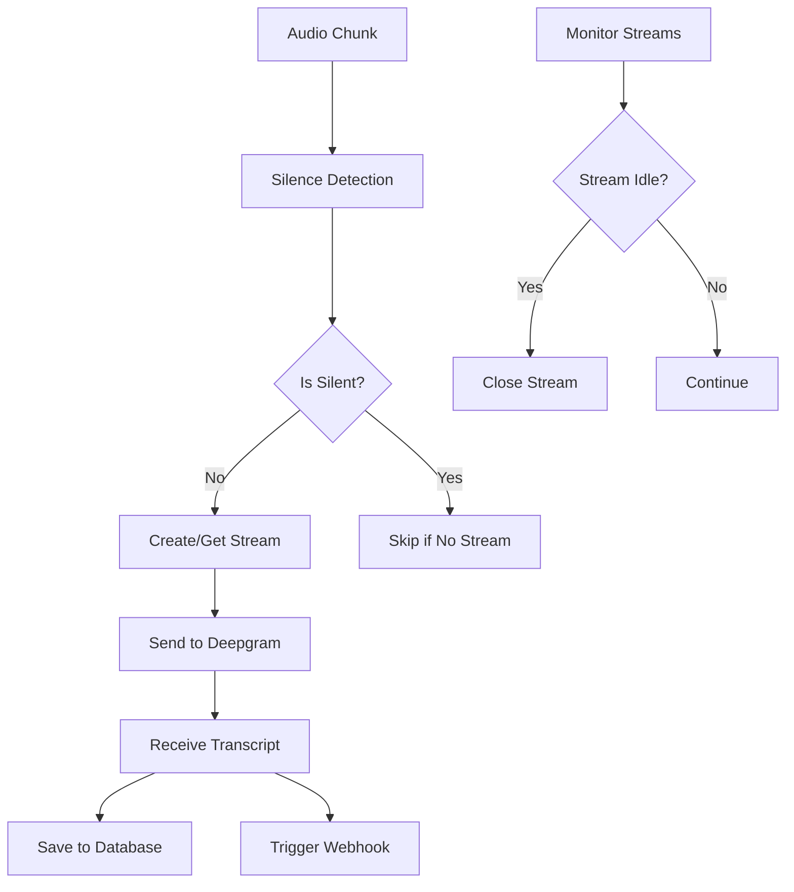
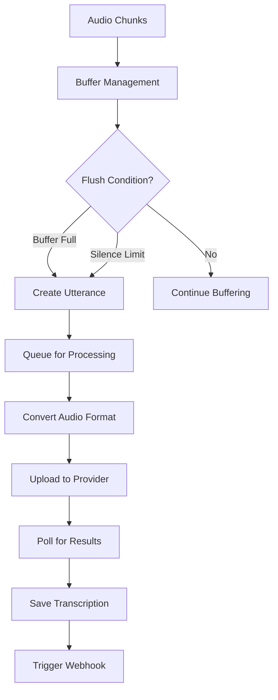
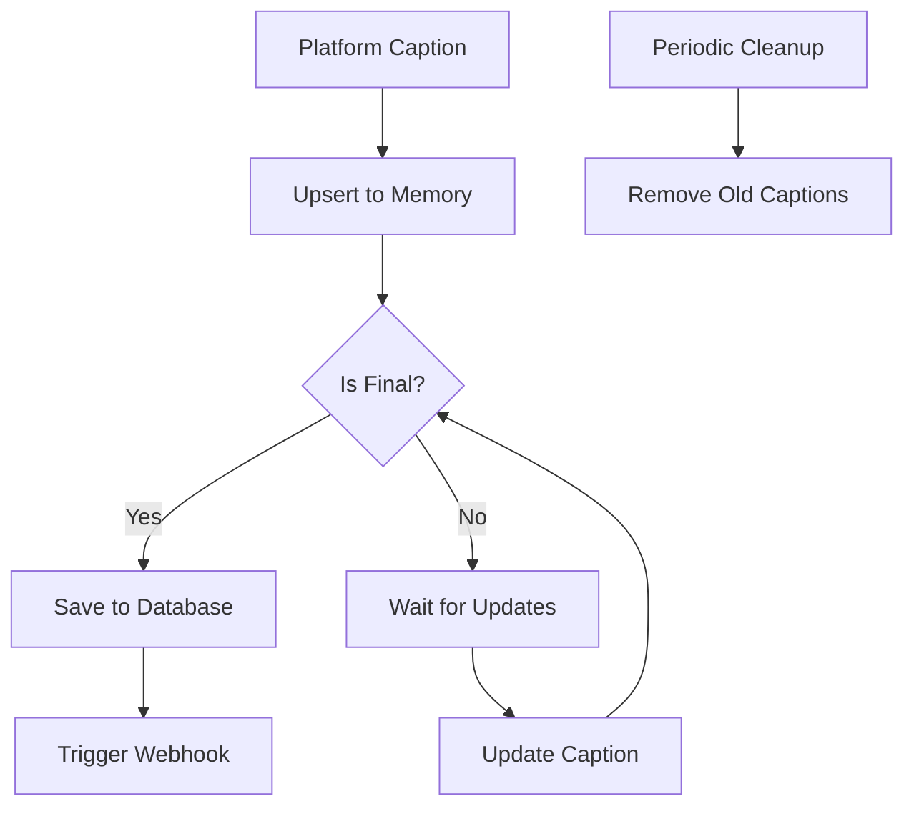

# Transcription Providers Guide

## Overview

The bot system supports multiple transcription providers for converting speech to text. The system can handle both streaming (real-time) and batch (post-processing) transcription workflows, with automatic provider selection based on platform capabilities and user preferences.

## Available Transcription Providers

### 1. Deepgram (Real-time Streaming)

**Type**: Streaming transcription provider  
**Use Case**: Real-time transcription with immediate results  
**Platform Support**: All platforms  

#### Configuration
```python
# Bot configuration for Deepgram
{
    "transcription_settings": {
        "deepgram": {
            "model": "nova-2",
            "language": "en-US",
            "callback": "https://webhook.example.com/transcription",
            "redaction": ["pii", "numbers"]
        }
    }
}
```

#### Features
- **Real-time Results**: Immediate transcription as speech occurs
- **Interim Results**: Partial transcriptions that update in real-time
- **Language Detection**: Automatic or configured language selection
- **Smart Formatting**: Automatic punctuation and capitalization
- **Redaction**: PII and sensitive data filtering
- **Metadata**: Custom metadata attachment to transcriptions

#### Implementation Details
```python
class DeepgramStreamingTranscriber:
    def __init__(self, *, deepgram_api_key, interim_results, language, 
                 model, sample_rate, metadata, callback, redaction_settings):
        # Configure WebSocket connection with keepalive
        config = DeepgramClientOptions(options={"keepalive": "true"})
        self.deepgram = DeepgramClient(deepgram_api_key, config)
        self.dg_connection = self.deepgram.listen.websocket.v("1")
        
        # Set up event handlers
        self.dg_connection.on(LiveTranscriptionEvents.Transcript, self.on_message)
        self.dg_connection.on(LiveTranscriptionEvents.Error, self.on_error)
        
        # Configure transcription options
        options = LiveOptions(
            model=model,
            smart_format=True,
            language=language,
            encoding="linear16",
            sample_rate=sample_rate,
            interim_results=interim_results,
            extra=metadata,
            callback=callback,
            redact=redaction_settings
        )
        
        self.dg_connection.start(options)
```

#### Usage Pattern
```python
# Create transcriber for each speaker
transcriber = DeepgramStreamingTranscriber(
    deepgram_api_key=api_key,
    interim_results=True,
    language="en-US",
    model="nova-2",
    sample_rate=48000,
    metadata=["bot_id:12345", "participant:speaker_1"],
    callback="https://webhook.example.com/transcription"
)

# Stream audio chunks
transcriber.send(audio_chunk_bytes)

# Clean up when done
transcriber.finish()
```

### 2. OpenAI Whisper (Batch Processing)

**Type**: Batch transcription provider  
**Use Case**: High-accuracy post-processing transcription  
**Platform Support**: All platforms  

#### Features
- **High Accuracy**: State-of-the-art speech recognition
- **Multiple Languages**: Support for 50+ languages
- **Automatic Language Detection**: No language configuration required
- **Speaker Identification**: Basic speaker detection
- **Timestamps**: Word-level timing information

#### Implementation
```python
def get_transcription_via_openai(utterance):
    # Get credentials
    openai_credentials = get_openai_credentials(utterance.recording.bot.project)
    
    # Convert audio format
    payload_mp3 = pcm_to_mp3(utterance.audio_blob.tobytes(), 
                            sample_rate=utterance.sample_rate)
    
    # Configure request
    files = {"file": ("audio.mp3", payload_mp3, "audio/mpeg")}
    data = {
        "model": "whisper-1",
        "response_format": "verbose_json",
        "timestamp_granularities[]": "word"
    }
    
    # Add language if specified
    if utterance.recording.bot.openai_language():
        data["language"] = utterance.recording.bot.openai_language()
    
    # Add prompt for context
    if utterance.recording.bot.openai_prompt():
        data["prompt"] = utterance.recording.bot.openai_prompt()
    
    # Make API request
    response = requests.post(
        "https://api.openai.com/v1/audio/transcriptions",
        headers={"Authorization": f"Bearer {api_key}"},
        files=files,
        data=data
    )
    
    return process_openai_response(response)
```

### 3. AssemblyAI (Batch Processing)

**Type**: Batch transcription provider  
**Use Case**: Feature-rich transcription with advanced analytics  
**Platform Support**: All platforms  

#### Features
- **Advanced Speech Models**: Multiple specialized models
- **Language Detection**: Automatic language identification
- **Content Moderation**: Automatic content filtering
- **Entity Detection**: Named entity recognition
- **Keyword Spotting**: Custom keyword detection
- **Speaker Diarization**: Multi-speaker identification

#### Configuration Options
```python
{
    "transcription_settings": {
        "assembly_ai": {
            "language_detection": True,
            "speech_model": "universal",
            "keyterms_prompt": "meeting, presentation, quarterly results"
        }
    }
}
```

#### Implementation
```python
def get_transcription_via_assemblyai(utterance):
    # Upload audio file
    upload_response = requests.post(
        f"{base_url}/upload",
        headers={"authorization": api_key},
        data=audio_data
    )
    upload_url = upload_response.json()["upload_url"]
    
    # Configure transcription request
    data = {
        "audio_url": upload_url,
        "speech_model": "universal"
    }
    
    # Add optional features
    if bot.assembly_ai_language_detection():
        data["language_detection"] = True
    elif bot.assembly_ai_language_code():
        data["language_code"] = bot.assembly_ai_language_code()
    
    if bot.assemblyai_keyterms_prompt():
        data["keyterms_prompt"] = bot.assemblyai_keyterms_prompt()
    
    # Submit transcription job
    response = requests.post(
        f"{base_url}/transcript",
        headers={"authorization": api_key},
        json=data
    )
    
    return poll_for_completion(response.json()["id"])
```

### 4. Gladia (Batch Processing)

**Type**: Batch transcription provider  
**Use Case**: Multi-language support with speaker diarization  
**Platform Support**: All platforms  

#### Features
- **Multi-language Support**: 100+ languages
- **Speaker Diarization**: Advanced speaker separation
- **Code-switching**: Handle multiple languages in same audio
- **Custom Vocabulary**: Domain-specific terminology
- **Audio Intelligence**: Sentiment analysis and summarization

### 5. Sarvam (Batch Processing)

**Type**: Batch transcription provider  
**Use Case**: Specialized for Indian languages  
**Platform Support**: All platforms  

#### Features
- **Indian Language Focus**: Optimized for Hindi, Tamil, Telugu, etc.
- **Short Audio Optimization**: Optimized for 30-second clips
- **Cultural Context**: Understanding of Indian names and contexts

#### Special Handling
```python
def non_streaming_audio_utterance_size_limit(self):
    """Sarvam has 30-second audio limit"""
    if self.get_recording_transcription_provider() == TranscriptionProviders.SARVAM:
        return 1920000  # 30 seconds at 32kHz
    else:
        return 19200000  # 300 seconds for other providers

def non_streaming_audio_silence_duration_limit(self):
    """Shorter silence detection for Sarvam"""
    if self.get_recording_transcription_provider() == TranscriptionProviders.SARVAM:
        return 1  # 1 second
    else:
        return 3  # 3 seconds
```

### 6. Closed Captions from Platform

**Type**: Platform-native captions  
**Use Case**: Use meeting platform's built-in transcription  
**Platform Support**: Google Meet, Teams, Zoom Web  

#### Features
- **No Additional Cost**: Uses platform's free transcription
- **Real-time**: Immediate availability
- **Platform Optimized**: Optimized for each platform's audio processing
- **Language Support**: Varies by platform

#### Implementation
```python
def upsert_caption(self, caption_data: dict):
    """Handle platform captions"""
    caption_id = str(caption_data["captionId"])
    device_id = caption_data["deviceId"]
    key = f"{device_id}:{caption_id}"
    
    if key in self.captions:
        self.captions[key].update(caption_data)
    else:
        self.captions[key] = CaptionEntry(caption_data)

def process_captions(self, should_flush=False):
    """Convert captions to utterances"""
    for key, entry in list(self.captions.items()):
        if entry.should_upsert_to_db(should_flush=should_flush):
            self.save_utterance_callback({
                "timestamp_ms": int(entry.created_at.timestamp() * 1000),
                "duration_ms": int((entry.modified_at - entry.created_at).total_seconds() * 1000),
                "text": entry.caption_data.get("text", ""),
                "source_uuid_suffix": f"{device_id}-{caption_id}"
            })
```

## Provider Selection Logic

### Automatic Provider Selection

The system automatically selects the optimal transcription provider based on:

1. **User Configuration**: Explicit provider selection in bot settings
2. **Platform Capabilities**: What the meeting platform supports
3. **Default Fallbacks**: Sensible defaults for each platform

```python
def transcription_provider_from_bot_creation_data(data):
    """Determine transcription provider from bot configuration"""
    settings = data.get("transcription_settings", {})
    url = data.get("meeting_url")
    use_zoom_web_adapter = data.get("zoom_settings", {}).get("sdk") == "web"
    
    # Check for explicit provider configuration
    if "deepgram" in settings:
        return TranscriptionProviders.DEEPGRAM
    elif "gladia" in settings:
        return TranscriptionProviders.GLADIA
    elif "openai" in settings:
        return TranscriptionProviders.OPENAI
    elif "assembly_ai" in settings:
        return TranscriptionProviders.ASSEMBLY_AI
    elif "sarvam" in settings:
        return TranscriptionProviders.SARVAM
    elif "meeting_closed_captions" in settings:
        return TranscriptionProviders.CLOSED_CAPTION_FROM_PLATFORM
    
    # Default provider selection
    meeting_type = meeting_type_from_url(url)
    if meeting_type == MeetingTypes.ZOOM and not use_zoom_web_adapter:
        return TranscriptionProviders.DEEPGRAM  # Zoom native SDK
    else:
        return TranscriptionProviders.CLOSED_CAPTION_FROM_PLATFORM  # Web platforms
```

### Platform-Specific Defaults

| Platform | Default Provider | Reason |
|----------|-----------------|---------|
| **Zoom Native SDK** | Deepgram | Better audio quality from SDK |
| **Zoom Web** | Platform Captions | Browser-based limitations |
| **Google Meet** | Platform Captions | Excellent built-in transcription |
| **Teams** | Platform Captions | Good native caption support |

## Transcription Processing Workflow

### Streaming Workflow (Deepgram)



### Batch Workflow (OpenAI, AssemblyAI, etc.)



### Platform Caption Workflow



## Configuration Examples

### Deepgram Real-time Configuration
```json
{
    "transcription_settings": {
        "deepgram": {
            "model": "nova-2",
            "language": "en-US",
            "interim_results": true,
            "smart_format": true,
            "profanity_filter": false,
            "redaction": ["pii"],
            "callback": "https://webhook.example.com/deepgram"
        }
    }
}
```

### OpenAI Whisper Configuration
```json
{
    "transcription_settings": {
        "openai": {
            "model": "whisper-1",
            "language": "en",
            "prompt": "This is a business meeting discussing quarterly results.",
            "temperature": 0.2
        }
    }
}
```

### AssemblyAI Advanced Configuration
```json
{
    "transcription_settings": {
        "assembly_ai": {
            "language_detection": true,
            "speech_model": "universal",
            "keyterms_prompt": "quarterly earnings, revenue, profit margin",
            "content_safety": true,
            "speaker_labels": true
        }
    }
}
```

### Platform Captions Configuration
```json
{
    "transcription_settings": {
        "meeting_closed_captions": {
            "language": "en-US",
            "merge_consecutive": true,
            "min_duration_ms": 1000
        }
    }
}
```

## Error Handling and Retry Logic

### Retry Strategy
```python
@shared_task(
    bind=True,
    soft_time_limit=3600,
    autoretry_for=(Exception,),
    retry_backoff=True,  # Exponential backoff
    max_retries=6,
)
def process_utterance(self, utterance_id):
    """Process utterance with automatic retry"""
    try:
        transcription, failure_data = get_transcription(utterance, recording)
        
        if failure_data and is_retryable_failure(failure_data):
            raise self.retry(countdown=60 * (2 ** self.request.retries))
        
        save_transcription_result(utterance, transcription, failure_data)
        
    except Exception as e:
        handle_transcription_error(utterance, e)
```

### Failure Classification
```python
class TranscriptionFailureReasons:
    CREDENTIALS_NOT_FOUND = "credentials_not_found"
    CREDENTIALS_INVALID = "credentials_invalid"
    AUDIO_UPLOAD_FAILED = "audio_upload_failed"
    AUDIO_TOO_SHORT = "audio_too_short"
    AUDIO_TOO_LONG = "audio_too_long"
    INTERNAL_ERROR = "internal_error"
    PROVIDER_TIMEOUT = "provider_timeout"
    QUOTA_EXCEEDED = "quota_exceeded"

def is_retryable_failure(failure_data):
    """Determine if transcription failure can be retried"""
    retryable_reasons = [
        TranscriptionFailureReasons.PROVIDER_TIMEOUT,
        TranscriptionFailureReasons.AUDIO_UPLOAD_FAILED,
        TranscriptionFailureReasons.INTERNAL_ERROR,
    ]
    return failure_data.get("reason") in retryable_reasons
```

## Performance and Cost Optimization

### Cost Comparison

| Provider | Pricing Model | Typical Cost | Best For |
|----------|---------------|--------------|----------|
| **Deepgram** | Per minute | $0.0059/min | Real-time needs |
| **OpenAI Whisper** | Per minute | $0.006/min | High accuracy |
| **AssemblyAI** | Per hour | $0.62/hour | Advanced features |
| **Platform Captions** | Free | $0 | Cost optimization |

### Performance Optimization

#### Streaming Provider Optimization
```python
def monitor_transcription(self):
    """Optimize streaming transcription resource usage"""
    # Remove idle streams
    for speaker_id, transcriber in list(self.streaming_transcribers.items()):
        if time.time() - self.last_nonsilent_audio_time[speaker_id] > 10:
            transcriber.finish()
            del self.streaming_transcribers[speaker_id]
    
    # Limit concurrent streams (max 4)
    if len(self.streaming_transcribers) > 4:
        oldest_transcriber = min(self.streaming_transcribers.values(), 
                                key=lambda x: x.last_send_time)
        oldest_transcriber.finish()
        del self.streaming_transcribers[oldest_transcriber.speaker_id]
```

#### Batch Provider Optimization
```python
def optimize_utterance_size(self, provider):
    """Optimize audio chunk sizes for different providers"""
    if provider == TranscriptionProviders.SARVAM:
        return 1920000  # 30 seconds (provider limit)
    elif provider == TranscriptionProviders.OPENAI:
        return 480000000  # 25 MB (file size limit)
    else:
        return 19200000  # 5 minutes (good balance)
```

## Best Practices

### 1. Provider Selection
- **Use Platform Captions** for cost-effective transcription when accuracy requirements are moderate
- **Use Deepgram** for real-time applications requiring immediate transcription
- **Use OpenAI Whisper** for highest accuracy post-processing
- **Use AssemblyAI** when advanced features like speaker diarization are needed

### 2. Audio Quality Optimization
```python
def optimize_audio_for_transcription(self, audio_data, provider):
    """Optimize audio quality for specific providers"""
    if provider == TranscriptionProviders.DEEPGRAM:
        # Deepgram prefers 16kHz or higher
        return ensure_minimum_sample_rate(audio_data, 16000)
    elif provider == TranscriptionProviders.OPENAI:
        # Whisper works well with various sample rates
        return audio_data
    else:
        # General optimization
        return normalize_audio_levels(audio_data)
```

### 3. Error Recovery
```python
def handle_transcription_failure(self, utterance, failure_data):
    """Implement graceful degradation"""
    if failure_data.get("reason") == "quota_exceeded":
        # Fall back to platform captions
        return switch_to_platform_captions(utterance.recording.bot)
    elif failure_data.get("reason") == "credentials_invalid":
        # Notify admin and disable provider
        notify_admin_of_credential_issue(utterance.recording.bot.project)
        disable_provider_for_project(utterance.recording.bot.project)
```

### 4. Monitoring and Analytics
```python
def track_transcription_metrics(self, utterance, provider, success, duration):
    """Track transcription performance metrics"""
    metrics = {
        "provider": provider,
        "success": success,
        "processing_duration": duration,
        "audio_length": utterance.duration_ms,
        "accuracy_score": calculate_accuracy_score(utterance)
    }
    send_to_analytics(metrics)
```

This comprehensive transcription system provides flexible, scalable speech-to-text capabilities across multiple providers while optimizing for cost, accuracy, and performance based on specific use cases.
